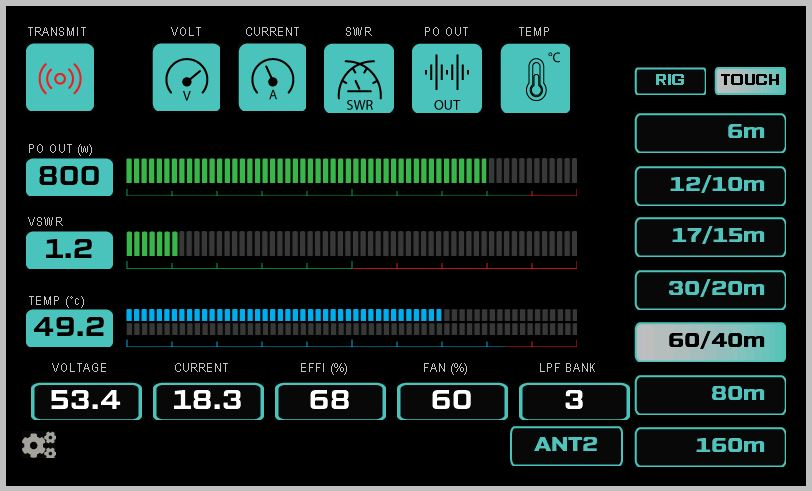
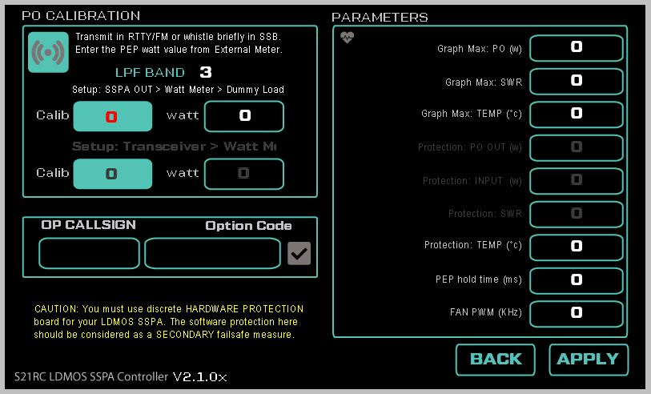
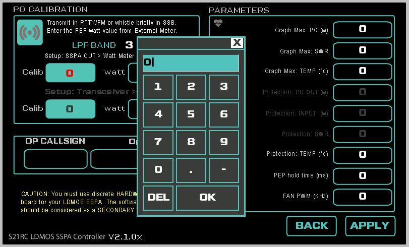
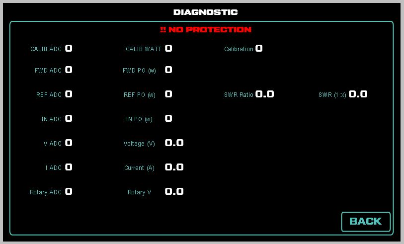

LICENSE: The full repository (including subfolders) is licensed under GPL v3

Including:

PCB Design

Schematics

Software codes

Display codes

This license gives the users freedom to do whatever they wish as long they honour the license terms (please check the LICENSE file). 

All derivatives or use of pertial codes need to be licensed under same License and need to be open source 

# ldmos_sspa_controller_v2.1_lite
A lite version of controller without any software protection, made on request for Hans/DF1JM. Simple for monitoring the SSPA parameters.

Arduino Code, HMI file, TFT file, PCB Gerber file is available for your download and use.
Hardware is same V1.x

